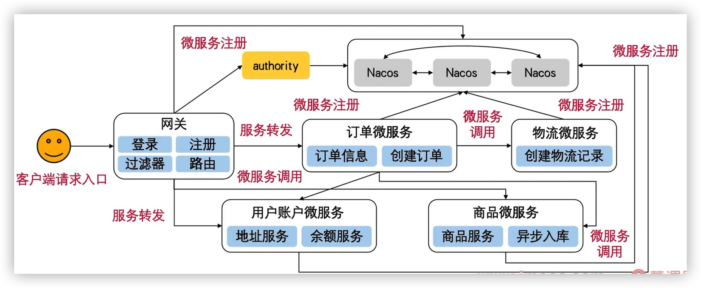

#### 微服务

##### 微服务演进过程


**单体架构**：开发部署上线简单；代码耦合严重，修改后需要重新打包部署


**垂直应用架构**：部署独立，水平扩展容易；搭建复杂，服务之间关系复杂，维护困难

垂直拆分，独立部署，独立数据库，独立的域名去部署


**SOA 架构**：通过总线提供底层服务的统一入口


**微服务**


##### 微服务架构遵循的原则

- 职责独立，每个微服务只做自己功能范围内的事，微服务之间的依赖链不要太长 (会导致问题追踪困难)
- 使用熔断器实现快速的故障容错 和 线程隔离
- 通过网管代理微服务请求，网关是微服务架构对外暴露的唯一入口
- 确保微服务 api 变更后能够向后兼容


##### 领域驱动设计 (DDD)

一种软件架构设计方法，不定义软件开发过程

利用面向对象的特性，以业务为核心驱动而不是传统数据库驱动开发

领域是对功能需求的划分，大领域下还有小领域

- 分析领域模型，推演实体、值对象、领域服务
- 找出聚合边界 (降低服务耦合)
- 为聚合配备存储仓库 (数据持久化)
- 实践 DDD，不断的推倒重构


用户接口；应用程序；领域；基础设置层


**电商工程业务解读 微服务模块拆分**


工程入口


电商功能 (账户，商品，订单，物流)


## 面试

**登录微服务**

gateway 中通过全局过滤器判断是不是登录注册请求，有没有权限访问对应微服务

**账户微服务**

维护 地址 和 余额 信息

**商品微服务**

维护商品信息(导入，查询，获取，减库存)

异步导入：使用指定的线程池执行异步任务 (将商品信息保存到数据表，更新商品缓存，将入库**商品信息**同步到 redis)

**订单微服务**

创建订单：创建订单 + 扣减库存 + 扣减余额 + 创建物流消息

查询订单


#### alibaba nacos

服务，配置服务，名字服务

- 服务注册中心：是服务、实例、元数据的数据库；会调用服务实例的健康检测 api 验证它能否处理请求

- 服务元数据：包括端点、服务标签、服务版本号、服务实例权重、路由规则、安全策略等描述服务的数据
- 服务提供/消费方
- 配置：一些需要变更的参数从代码中分离出来以独立的配置文件的形式存在


单机版本启动：./startup.sh -m standalone

配置自定义 mysql 持久化

```properties
### If use MySQL as datasource:
spring.datasource.platform=mysql

### Count of DB:
db.num=1

### Connect URL of DB:
db.url.0=jdbc:mysql://127.0.0.1:3306/nacos_config?characterEncoding=utf8&connectTimeout=1000&socketTimeout=3000&autoReconnect=true&useUnicode=true&useSSL=false&serverTimezone=GMT%2B8
db.user.0=root
db.password.0=root

### Connection pool configuration: hikariCP
db.pool.config.connectionTimeout=30000
db.pool.config.validationTimeout=10000
db.pool.config.maximumPoolSize=2
```


##### nacos 集群部署

- 定义集群部署的 ip 和 端口 (cluster.conf)
- 集群必须使用可以共同访问到的数据源作为持久化的方式，需要去数据库中创建表
- 修改 nacos 配置的端口号 application.properties
- 启动 ./startup.sh


##### nacos 服务注册与发现

注册通过配置文件完成：需要配置服务名称，namespace 等

发现通过代码完成：`SpringCloud` 提供的接口，`alibaba` 进行实现，通过 `DiscoveryClient `获取 `List<ServiceInstance>`


####  spring-boot-admin 监控

actuator

端点 endpoint

- 应用控制类：自动配置信息，bean信息，yml信息，环境信息

- 度量指标类：运行期信息 (堆栈，健康指标，metrics)

- 操作控制类：shutdown，发送一个请求关闭监控功能


将微服务注册到 admin

- 通过 springboot-admin-client，通过 http 调用注册进去

- 被监控的应用程序注册到注册中心，admin 通过注册中心获取到被监控的应用程序 `@EnableAdminServer`

  ```yaml
  # 如果有上下文路径
  metadata:
    management:
      context-path: ${server.servlet.context-path}/actuator
  ```


监控中心添加安全访问控制

```xml
<!-- 每个微服务都要有-->
<dependency>
    <groupId>org.springframework.boot</groupId>
    <artifactId>spring-boot-starter-actuator</artifactId>
</dependency>
<!-- springboot admin-->
<dependency>
    <groupId>de.codecentric</groupId>
    <artifactId>spring-boot-admin-starter-server</artifactId>
    <version>2.2.0</version>
</dependency>
<!-- 开启登录认证功能-->
<dependency>
    <groupId>org.springframework.boot</groupId>
    <artifactId>spring-boot-starter-security</artifactId>
</dependency>
```

暴露端点

```yaml
# 暴露端点
management:
  endpoints:
    web:
      exposure:
        include: '*' # 需要开发的端点，默认只打开 health, info
  endpoint:
    health:
      show-details: always
```


#### 基于 jwt 的身份认证授权

| jwt                              | session                            |
| -------------------------------- | ---------------------------------- |
| 直接解析得到用户信息             | 需要数据映射匹配                   |
| 只有过期时间限制                 | 保存在服务器，可控性更强           |
| 任意传播，可以跨服务器           | 需要在一台服务器上解析             |
| 存储在客户端                     | 存储在服务器端，数据量大会造成开销 |
| 生成之后，独立之后存在，难以控制 | 时效性由服务端控制                 |


#### SpringCloud Gateway 网关

所有微服务的统一入口，提供路由方式

- zuul：阻塞io，基于 servlet 2.5，不支持长连接

- gateway：  非阻塞io，spring5，支持websocket


三个组成部分

**gateway  -->  predicate  -->  filters  -->  service**

- 路由 route：是构建网关的基本模块,由ID、URI、一系列的断言和过滤器组成
- 断言 predicate：可以匹配HTTP请求中所有的内容(请求头、参数等等) , 请求与断言相匹配则通过当前断言
- 过滤器 filter：包括全局和局部过滤器,可以在请求被路由前后对请求进行更改


工作模型

- 请求发送到网关，经由分发起将请求匹配到 HandlerMapping
- 请求和处理器之间有一个映射，路由到网关处理程序
- 执行特定的请求过滤器链
- 到达代理的微服务


继承 nacos 实现动态路由配置

- 静态路由

  写在配置文件中 (spring.cloud.gateway)，每次修改都要重写部署

- 动态路由

  通过 `@PostConstruct` 在启动时给 nacos 客户端添加监听器，监控配置变化，每次 nacos 修改后，通过发布事件(`RefreshRoutesEvent`)动态修改 gateway 中的路由

**注册路由**

- 注入 RouteLocator，手动编写路由配置
- bootstrap.yml 中配置 spring.cloud.gateway
- 通过配置中心 nacos 实现动态路由配置


##### 过滤器

前置处理，后置处理

- 全局过滤器：作用于所有路由

  ```java
  @Component
  public class GlobalCacheRequestBodyFilter implements GlobalFilter, Ordered {
  }
  ```

- 局部过滤器

  ```java
  // 1. 创建一个局部过滤器
  public class HeaderTokenGatewayFilter implements GatewayFilter, Ordered {
  }
  
  // 2. 通过工厂注入进去
  @Component
  public class HeaderTokenGatewayFilterFactory extends AbstractGatewayFilterFactory<Object> {
  
      @Override
      public GatewayFilter apply(Object config) {
          return new HeaderTokenGatewayFilter();
      }
  }
  
  // 3. 添加到配置文件中
  
  
  
  添加前缀后缀
  PrefixPathGatewayFilterFactory
  StripPrefixGatewayFilterFactory
  ```
  


三种配置方式

- 在代码中注入`RouteLocatorBean` ，并手工编写配置路由定义
- 在 `application.yml` 或 `bootstrap.yml` 等配置文件中配置 `spring.cloud.gateway`
- 通过配置中心(Nacos)实现动态的路由配置


#### SpringCloud zipkin 数据解析


**对 sleuth 的数据实现收集解析**，展示完整的请求链路、耗时、依赖等等信息

默认将跟踪信息存储在内存中，重启后丢失

默认使用 http 方式上报跟踪数据，性能较差

配置 mysql 将跟踪数据持久化


#### Brave

- 一个 tracer 库，提供 tracer 接口

  - trace：一个逻辑执行过程中的整个链条

  - span：trace 跟踪的基本单位

- sleuth 采用 Barve 作为 tracer 库

- sleuth 可以不使用 zipkin


常用数据结构

- Tracing：工具类，生成 Tracer 实例
- Tracer：工具类，生成 Span 
- Span：记录每个功能块执行信息
- TraceContext：记录 trace 执行过程中的元数据信息
- Propagation：分布式环境或跨进程条件下 trace 跟踪时实现 TraceContext 传递的工具类


#### SpringCloud sleuth 日志追踪

跨服务 trace 跟踪

- sleuth：自动为当前应用构建各通信信道的跟踪机制

  - 通过 rabbitmq，kafka 等传递的请求
  - 通过 zuul，gateway 代理传递的请求
  - 通过 RestTemplate 发起的请求

  为了实现请求跟踪，当请求发送到分布式系统的入口时，需要服务跟中框架为该请求创建一个跟踪 id

  为了统计各单元的时间延迟，当请求到达各个服务组件 或 处理逻辑到达某个状态时，也通过唯一标记记录它的开始，具体过程 和 结束

- zipkin：实现对跟踪信息的收集

  解决微服务架构中的延迟问题 (数据收集，存储，查找，展现)
  
  - Collector：收集器组件
  - Storage：存储组件
  - api：提供外部访问接口
  - ui：提供可视化查询页面


##### 整合

```shell
# nacos
./bin/startup.cmd -m standalone

# kafka 追踪信息传输
./bin/windows/zookeeper-server-start.bat ./config/zookeeper.properties
./bin/windows/kafka-server-start.bat ./config/server.properties

# zipkin
java -DKAFKA_BOOTSTRAP_SERVERS=127.0.0.1:9092 -jar zipkin-server-2.23.16-exec.jar --STORAGE_TYPE=mysql --MYSQL_HOST=127.0.0.1 --MYSQL_TCP_PORT=3306 --MYSQL_DB=imooc_zipkin --MYSQL_USER=root --MYSQL_PASS=root

```


##### sleuth 采样率

- ProbabilityBasedSample：采样率策略，默认收集 10% 的请求跟踪信息

- RateLimitingSample：抽样策略 (优先级更高)，限速采集，每秒追踪请求的最大数量

  ```properties
  spring.sleuth.sampler.probability=0.5
  spring.sleuth.sampler.rate=10 # 优先级更高
  ```

  

```
// 请求发起者，trace id， span id， 是否采样
2022-06-01 16:25:01.176  INFO [commerce-authority-center,1b8b5699a0d77e3c,1b8b5699a0d77e3c,true] 11624 --- [nio-7000-exec-3] c.e.c.controller.AuthorityController     : request to get token with params: {"username":"qqq","password":"password"}
```


#### 用户账户微服务


##### 集成 swagger2


```shell
# nacos
/Users/qgs/Downloads/nacos-8848/bin/startup.sh -m standalone &

# redis
brew services start redis &

# zipkin
java -jar /Users/qgs/Downloads/zipkin-server-2.23.16-exec.jar --STORAGE_TYPE=mysql --MYSQL_HOST=127.0.0.1 --MYSQL_TCP_PORT=3306 --MYSQL_USER=root --MYSQL_PASS=root --MYSQL_DB=imooc_zipkin &

# kafka
/Users/qgs/Downloads/kafka_2.13-2.7.0/bin/zookeeper-server-start.sh /Users/qgs/Downloads/kafka_2.13-2.7.0/config/zookeeper.properties &

/Users/qgs/Downloads/kafka_2.13-2.7.0/bin/kafka-server-start.sh /Users/qgs/Downloads/kafka_2.13-2.7.0/config/server.properties &

# seata
sh bin/seata-server.sh -h 127.0.0.1 -p 8091 -m file & # 单机
sh bin/seata-server.sh -h 127.0.0.1 -p 8091 -m db -n 1 & # mysql
```


#### 微服务通信

- RPC：将可用服务放到注册中心，通过传递 方法名，参数等 进行调用
- http (rest)：RestTemplate
- Message：通过消息队列进行消息的发布订阅，可以实现 削峰填谷，缓冲机制实现数据任务缓存；只能做到最终一致性，做不到实时一致性


##### RestTemplate

- 配置文件中写死 ip, port
- 通过注册中心获取服务地址，可以实现负载均衡


##### 微服务通信 SpringCloud Netflix Ribbon 实现

用注册中心中的服务名 代替写死的 host, port ，使用被重写的 RestTemplate 发送请求

```java
// 给 RestTemplate 增加拦截器，在请求之前对请求的地址进行替换，或者根据具体的负载策略选择服务地址，然后再去调用，这就是 @LoadBalanced 的原理
// ClientHttpRequestInterceptor + SmartInitializingSingleton

// org.springframework.cloud.client.loadbalancer.LoadBalancerAutoConfiguration
@Bean
@LoadBalanced
public RestTemplate restTemplate() {
    return new RestTemplate();
}
```


##### SpringCloud OpenFeign 组合 ribbon + feign

```java
@EnableFeignClients

@FeignClient(value = "commerce-authority-center", contextId = "AuthorityFeignClient")
```

Feign OpenFeign

- 他们底层都是内置了Ribbon，去调用注册中心的服务。
- Feign是Netflix公司写的，是SpringCloud组件中的一个轻量级RESTful的HTTP服务客户端，是SpringCloud中的第一代负载均衡客户端。
- OpenFeign是SpringCloud自己研发的，在Feign的基础上支持了Spring MVC的注解，如@RequesMapping等等。是SpringCloud中的第二代负载均衡客户端。
- Feign本身不支持Spring MVC的注解，使用Feign的注解定义接口，调用这个接口，就可以调用服务注册中心的服务
- OpenFeign的@FeignClient可以解析SpringMVC的@RequestMapping注解下的接口，并通过动态代理的方式产生实现类，实现类中做负载均衡并调用其他服务。


#### SpringCloud Netflix Hystrix 服务容错

故障隔离

- 通过添加 延迟容忍 和 容错逻辑，控制分布式服务之间的交互
- 通过隔离服务之间的访问点，停止级联服务，通过回退选项 提供服务之间的容错
- 目标
  - 对客户端的延迟 和 故障 进行保护控制
  - 在复杂的分布式系统中阻止级联故障
  - 快速失败，快速恢复
  - 兜底回退，尽可能优雅降级


下游服务出现错误超时问题时，让客户端快速失败，不消耗当前服务的数据库连接、线程池等资源，保证当前服务不会被下游服务拖垮


**Hystrix 完整的工作流程**

- 构造一个 `HystrixCommand` 或者 `HystrixObservableCommand` 对象

- 执行命令获取响应

  - execute：同步阻塞,直到收到响应或者抛出异常

  - queue：异步返回一个Future

  - observe：订阅代表响应的 Observable

  - toObservable：返回一个Observable ,当你订阅它以后,将会执行 Hystrix 命令并且推送它的响应

- 判断
  - 响应是否被缓存
  - 断路器是否打开 (打开后直接 fallback)
  - 线程池，信号量是否使用了 100%
- 执行
  - com.netflix.hystrix.HystrixCommand#run 只能返回单条数据
  - com.netflix.hystrix.HystrixObservableCommand#construct 可以返回多条数据
- 计算电路健康
- 回退 或 返回成功响应


##### 服务容错

三种模式

- 断路器模式：设置超时 或 失败等 熔断策略

- 后备策略模式：断路器模式触发后，执行后备策略

- 舱壁模式：为每个服务分别指定线程池 或 使用信号量完成；可以通过代码 和 注解完成功能

  - 线程池

    ```java
    // 通过 HystrixObservableCommand 接口完成
    public class NacosClientHystrixObservableCommand extends HystrixObservableCommand<List<ServiceInstance>>
    ```

    

  - 信号量

    ```java
    // 通过 HystrixCommand 完成
    public class NacosClientHystrixCommand extends HystrixCommand<List<ServiceInstance>>
    ```

    

##### 请求缓存

将结果缓存到上下文中

- 代码

  初始化 hystrix 请求上下文

  重写 com.netflix.hystrix.AbstractCommand#getCacheKey

- 注解

  初始化 hystrix 请求上下文

  ```java
  // @CacheResult：方法的返回值会被缓存，需要与 @HystrixCommand 一起使用
  // @CacheRemove：让缓存失效
  // @CacheKey：标记为 key (默认将方法的所有入参作为 key)
  
  @CacheResult
  @HystrixCommand(commandKey = "CacheHystrixCommandAnnotation")
  public List<ServiceInstance> useCacheByAnnotation2(@CacheKey String serviceId) {
      log.info("02. serviceId: {}", serviceId);
      return nacosClientService.getNacosInfo(serviceId);
  }
  @CacheRemove(commandKey = "CacheHystrixCommandAnnotation")
  @HystrixCommand
  public void flushCacheByAnnotation2(@CacheKey String cacheId) {
      log.info("02. 清除缓存: {}", cacheId);
  }
  ```

  

##### 请求合并

适用场景：单个对象的查询并发数很高,服务提供方负载较，就可以考虑使用请求合并

注意事项.

- 请求在代码中人为的设置了延迟时间,会降低请求的响应速度

- 可能会提高服务提供方的负载,因为返回List结果数据量偏大

- 实现请求合并比较复杂


##### 后备模式

组合 openFeign，Hystrix


修改配置文件 `feign.hystrix.nabled = true`

- 创建另一个类实现 OpenFeign 的接口，实现里面的方法作为后备模式 (拿不到异常信息)

- 通过实现 `FallbackFactory` 接口可以拿到异常信息


##### Dashboard 监控客户端容错


#### 消息驱动微服务

Spring Messaging：统一消息的编程模型

将消息抽象为 `org.springframework.messaging.Message` = header + payload


##### SpringCloud Stream


- Binder：与中间件交互(通信)的抽象绑定器，屏蔽底层中间件的使用细节
- IO：发送消息与接送消息的应用通信信道

发布订阅模型

- topic：
- producer：
- consumer：


##### 自定义通道

发送接收消息

- 默认通道

- 自定义通道


##### 消息分组

- 应用的不同实例放在一个消费者组中，每一条消息只会被一个实例消费
- 消费者组的思想时通过多实例扩展服务吞吐量，不会造成消息的重复消费


##### 消费分区

- 作用：确保具有共同**特征**标识的数据由同一个消费者实例进行处理


#### 分布式事务

微服务之间存在调用，整个调用过程存在多处写数据库行为，分布式事务需要保证所有操作全部成功或失败

(创建订单：扣余额 + 扣库存 + 创建物流)

- 强一致性：任意一次都能读到某个数据库的最近一次写的数据
- 弱一致性：数据更新后，能容忍后续的访问只能访问到部分或全部访问不到 (通知)
- 最终一致性：不保证任意时刻数据都是完整的，随着时间的推移会到达一致性状态


解决方案

- 两阶段提交：使用一个中央协调器，先询问是否就绪，然后统一提交或回滚
- 本地消息表 (最终一致性)：将分布式处理的任务通过消息日志的方式异步执行


##### Stata

- TC (Transaction Coordinator) - 事务协调者

  维护全局和分支事务的状态，驱动全局事务提交或回滚。

- TM (Transaction Manager) - 事务管理器

  定义全局事务的范围：开始全局事务、提交或回滚全局事务。

- RM (Resource Manager) - 资源管理器

  管理分支事务处理的资源，与TC交谈以注册分支事务和报告分支事务的状态，并驱动分支事务提交或回滚。


##### 事务模式

- AT

  两阶段协议

  - 一阶段：业务数据和回滚日志记录在同一个本地事务中提交，释放本地锁和连接资源。
  - 二阶段：
    - 提交异步化，非常快速地完成。
    - 回滚通过一阶段的回滚日志进行反向补偿。

- TCC

- Saga

- XA


##### 使用

1. pom.xml 中引入依赖: `spring-cloud-starter-alibaba-seata, HikariCP`

2. 创建 `undo.log` 表(如果业务使用了多个数据库,每一个数据库都要有这张表)
3. 配置事务分组
4. 配置Seata数据源代理
5. 加载拦截器 `SeataHandlerInterceptor`,实现微服务之间xid的传递
6. 将 `@GlobalTransactional` 注解标注在需要分布式事务的方法上


#### 订单微服务

订单：创建订单 + 扣减库存 + 扣减余额 + 创建物流


#### 物流微服务

没有对外暴露任何接口，只是去消费订单服务的消息


#### SpringCloud Alibaba Sentinel 网关限流

功能

- 查看机器列表以及健康情况：收集 Sentinel 客户端发送的心跳包，用于判断机器是否在线

- 监控(单机和集群聚合)：通过 Sentinel 客户端暴露的监控API，定期拉取并且聚合应用监控信息，最终可以实现秒级的实时监控
- 规则管理和推送：统一管理推送规则


流量控制组件 (方法签名，url，服务名)

- 流量控制规则
- 熔断降级规则
- 系统保护规则


功能

- 查看及其列表及健康状况

- 监控 (单机 和 集群)

- 规则管理和推送


##### 流量控制方向

- 资源的调用关系
- 运行指标 (qps，线程池，系统负载)
- 控制效果 (直接限流，冷启动，排队)


```sh
java -Dserver.port=7777 -Dcsp.sentinel.dashboard.server=localhost:7777 -Dproject.name=sentinel-dashboard -jar sentinel-dashboard-1.8.1.jarj
```


编码方式完成

- 使用 `@PostConstructor` 初始化流控规则

- 对需要流量控制的 controller 资源上添加 `@SentinelResource`，可以添加 blockHandler 处理异常

dashboard 可视化配置

- 根据资源名称流控 (controller 中的 resoure 方法)
- 根据簇点链路流控 (url)


限流策略

- DefaultController：算出当前时间窗口的count，满足qps要求就放行，不满足直接拒绝
- RateLimiterController：基于固定频率的限流机制，限制两次请求间隔指定时间
- WarmUpController：曲线爬坡，逐步增加系统QPS限制
- WarmUpRateLimiterController：


##### 降级

可以对 RestTemplate 进行配置，开启服务之间的调用保护


- 流控降级：针对簇点链路中的 url

  根据流量、并发线程数、响应时间等指标，把随机到来的流量调整成合适的形状，即流量塑性，保证系统在流量突增情况下的可用性，避免系统被瞬时的流量高峰冲垮，一旦达到阈值则进行拒绝服务、排队等降级操作

- 降级：服务不可用时不会生效 (restTemplate 出错后只能处理 BlockException)

  关闭一些不重要的接口，把资源交给相对重要的接口，一般由人工触发


##### 熔断降级

当下游服务发生一定数量的失败后，打开熔断器，后续请求就快速失败。


##### sentinel + openfeign 熔断降级

开启 sentinel + openfeign

```yml
# sentinel + openfeign
feign:
  sentinel:
    enabled: true
```

启动类添加  @EnableFeignClients

创建一个 openFeign 的接口 (通过 sentinel 对 openFeign 实现熔断降级)

```java
@FeignClient(value = "commerce-imooc", fallback = SentinelFeignClientFallback.class)
public interface SentinelFeignClient {

    @RequestMapping(value = "getResultByFeign", method = RequestMethod.GET)
    CommonResponse<String> getResultByFeign(@RequestParam Integer code);

}
```

实现上面的接口 ( sentinel 对 openFeign 接口的降级策略)


##### sentinel + nacos 实现限流规则持久化

sentinel dashboard 将规则保存到内存中，重启后丢失，

nacos 中添加配置

```json
[
  {
    "resource": "byResource", // 资源名 (限流规则的作用对象)
    "limitApp": "default", //
    "grade": 1, // 限流的阈值类型 0/1: 线程数/qps
    "count": 1, // 限流阈值
    "strategy": 0, // 流控模式 0/1/2: 直接/关联/链路
    "controlBehavior": 0, // 流控效果 0/1/2: 快速失败/warn up/排队等待
    "clusterMode": false // 集群效果
  }
]

```

添加依赖  sentinel-datasource-nacos

添加 流控规则

```java
@SentinelResource(value = "byResource",
        blockHandler = "blockHandler",
        blockHandlerClass = MyBlockHandler.class)
```

bootstrap.yml 添加数据源配置

```yml
spring:
  cloud:
    sentinel: 
      datasource:
        # 名称任意，代表数据源
        ds:
          # 从 nacos 中读取配置
          nacos:
            server-addr: ${spring.cloud.nacos.discovery.server-addr}
            data-id: ${spring.application.name}-sentinel
            namespace: ${spring.cloud.nacos.discovery.namespace}
            group-id: DEFAULT_GROUP
            data-type: json
            # 规则类型 (限流规则)
            rule-type: flow
```


##### gateway + sentinel 实现网关限流

GatewayFlowRule

```sh
# 添加 gateway 支持，添加参数 csp.sentinel.app.type
java -Dserver.port=7777 -Dcsp.sentinel.app.type=1 -Dcsp.sentinel.dashboard.server=localhost:7777 -Dproject.name=gateway-sentinel-dashboard -jar /Users/qgs/Downloads/sentinel-dashboard-1.8.1.jar &
```

1. 通过代码完成

   添加全局过滤器 `SentinelGatewayFilter`

   初始化限流规则 `GatewayRuleManager.loadRules(rules);`

   加载限流分组 (可以指定特定的 url，模糊匹配等)  `GatewayApiDefinitionManager.loadApiDefinitions(definitions);`

   可以使用自定义的异常处理器  `GatewayCallbackManager.setBlockHandler(handler);`
   
   (sentinel 先去找规则定义，然后找规则中定义的分组，根据 url 确定限流策略)


2. 通过配置文件完成

   创建规则文件

   ```yml
   {
     "resource": "commerce-nacos-client", 
     "resourceMode": 0, # 0/1 serviceId/api分组
     "count": 3,
     "intervalSec": 60
   },
   ```

   修改 bootstrap.yml

   ```yml
   spring:
     cloud:
       sentinel: 
         datasource:
           # 基于本地文件配置基于服务级别的配置
           ds1.file:
             file: classpath:gateway-flow-rule-sentinel.json
             # 限流级别 (服务)
             ruleType: gw-flow
           # 配置对更细粒度的 api 的配置
           ds2.file:
             file: classpath:gateway-flow-rule-api-sentinel.json
             # api 分组
             ruleType: gw-api-group
   ```

   


##### nacos gateway sentinel

将上面的 json 文件放到 nacos 中

修改 bootstrap.yml

```yml
datasource:
  ds1:
    nacos:
      server-addr: ${spring.cloud.nacos.discovery.server-addr}
      namespace: ${spring.cloud.nacos.discovery.namespace}
      data-id: gateway-flow-rule-sentinel
      group-id: DEFAULT_GROUP
      data-type: json
      rule-type: gw-flow
```


##### 总结

sentinel:

- 基于硬编码实现限流功能
- 按照资源 `@SentinelResource` 名称和 url 实现限流
- 对服务间调用进行降级
- openFeign 集成 sentinel 实现服务容错降级
- sentinel 集成 nacos 实现限流规则持久化

gateway + sentinel 网关限流

- 基于硬编码实现对请求的限流
- 使用配置文件进行限流
- 使用 nacos 随时修改限流规则


#### 部署


##### 结构


##### 交互




##### 依赖

- 数据存储：mysql, redis
- 消息对象：kafka
- 分布式日志追踪：zipkin dashboard
- 服务注册与发现：nacos
- 限流：sentinel dashboard
- 分布式事务：seata


##### nginx

- 负载均衡
- 动静分离
- 拦截非法请求

```sh
brew services start nginx
```


